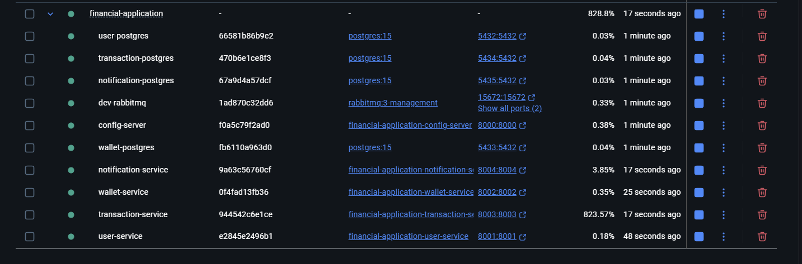

# Financial Application - Microservices
___

## 🚀 Microservices Backend Architecture
This project is a microservices-based backend system composed of the following services:

- User Service
- Wallet Service
- Transaction Service
- Notification Service
- Config Server
- RabbitMQ (Messaging Broker)
- PostgreSQL (Databases)

_Each service is containerized and orchestrated using Docker Compose._

```
financial-application
    ├── config-server/
    ├── user/
    ├── wallet/
    ├── transaction/
    ├── notification/
    ├── docker-compose.yml
    └── README.md
```

Containers running 


### 🛠️ Tech Stack
- Java 17 / Spring Boot
- PostgreSQL (one DB per service)
- RabbitMQ (message broker)
- Docker & Docker Compose
- Spring Cloud Config
- REST APIs
- SwaggerUI
- Topic-based Messaging with RabbitMQ

### Run

🐳 Run with Docker Compose

```bash
  docker-compose up --build 
```
_Ensure no other services are using ports 5432, 5433, 5434, 5435, 8000-8004, 5672, or 15672_

To stop:

```bash
docker-compose down
```

To stop and remove volumes:

```bash
docker-compose down -v
```

### 🧪 Service Ports

| Service                   | Port  |
| ------------------------- | ----- |
| Config Server             | 8000  |
| User Service              | 8001  |
| Wallet Service            | 8002  |
| Transaction Service       | 8003  |
| Notification Service      | 8004  |
| RabbitMQ (App)            | 5672  |
| RabbitMQ (Management)     | 15672 |
| PostgreSQL - User         | 5432  |
| PostgreSQL - Wallet       | 5433  |
| PostgreSQL - Transaction  | 5434  |
| PostgreSQL - Notification | 5435  |


### 👨‍💻 Author
Built with ❤️ by Zelalem Gizachew

📧 zelalemgizachew890@gmail.com

🔗 [LinkedIn](https://www.linkedin.com/in/zelalem-gizachew-28012a230/) | [GitHub](https://github.com/ZelalemGizachew)